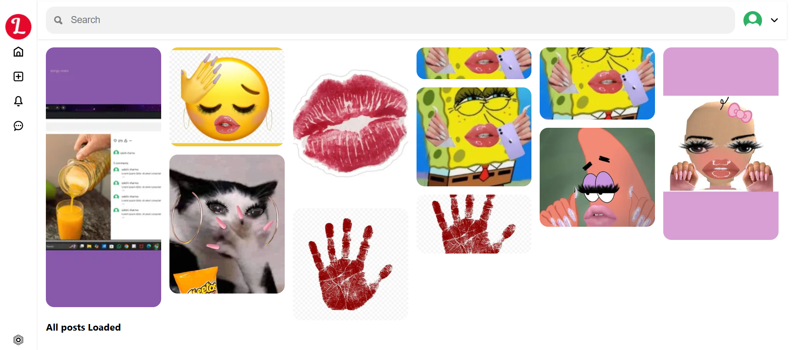
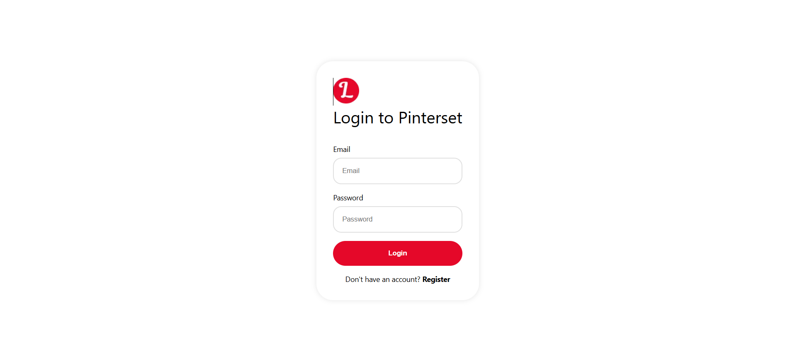
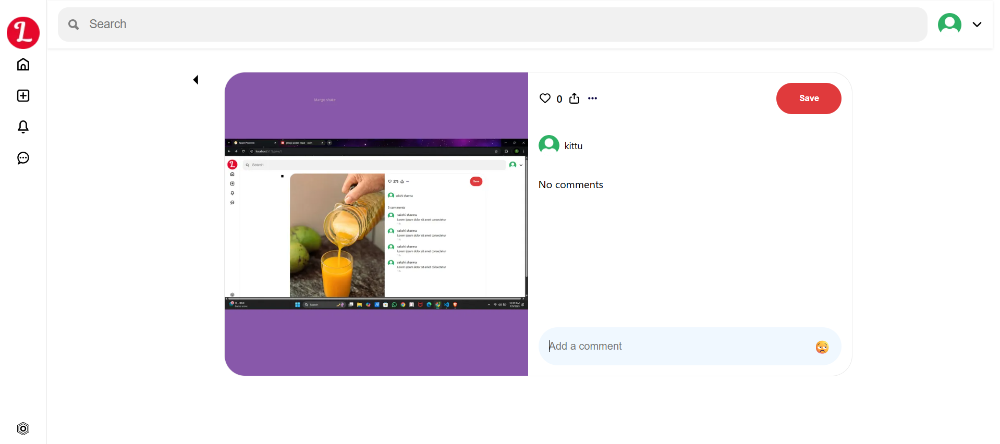
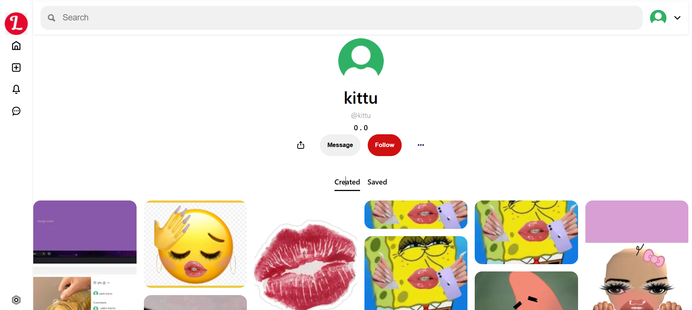
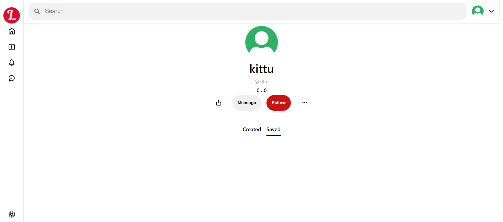
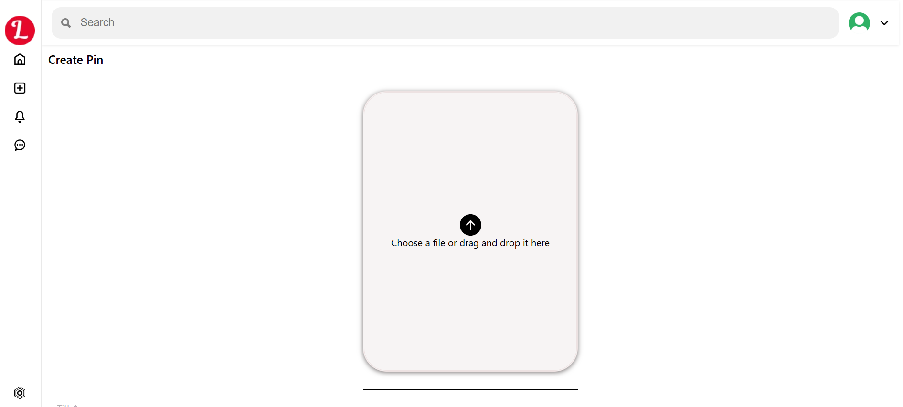
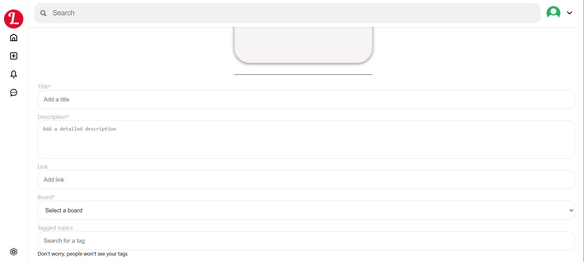
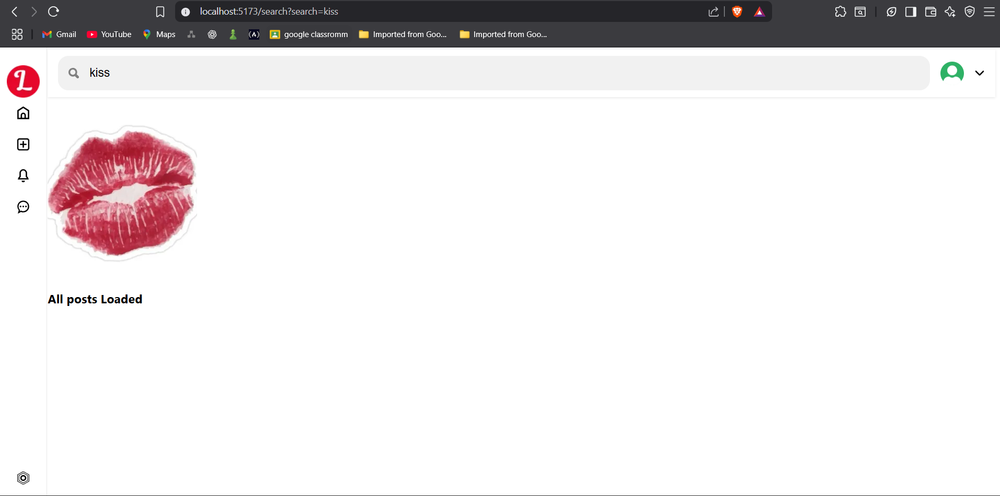

# 📌 Pinterest Clone – MERN Stack

A full-stack Pinterest-style image sharing web application built using the MERN stack (MongoDB, Express.js, React.js, Node.js). This project replicates the core features of Pinterest, allowing users to register, log in, upload images (pins), and view them in a responsive masonry-style layout.

---

## 🚀 Features

- 🧑‍💻 User authentication using JWT
- 🖼️ Upload and display image pins
- 📱 Fully responsive grid layout
- 🔐 Protected routes for logged-in users
- 💾 MongoDB integration for data storage
- ⚙️ RESTful API with Express.js

---

## 🛠️ Tech Stack

| Frontend | Backend | Database | Authentication |
|----------|---------|----------|----------------|
| React.js | Node.js | MongoDB  | JWT            |
| Tailwind CSS | Express.js | Mongoose | bcrypt |

---
## 📁 Project Structure
pinterest-clone/
├── backend/ # Node.js + Express API
├── frontend/ # React.js client
└── README.md # Project details


---

## ⚙️ Setup Instructions

### 🔹 Clone the repository

```bash
git clone https://github.com/SakshiSharma6789/Pinterest-Clone.git
cd Pinterest-Clone

🔹 Backend Setup
 cd backend
 npm install

Create a .env file in the backend folder:
PORT=5000
MONGO_URI=your_mongodb_uri
JWT_SECRET=your_secret_key

Run backend:
npm start


### 🔹 Frontend Setup

```bash
cd frontend
npm install
npm start

---

```
##  Screenshots
### Home page



### Login page


### Post page 


### Profile page



###Post create page



###Serach page


---

## 📝 License
This project is licensed under the MIT License.

## 👩‍💻 Author
### Sakshi Sharma

💼 GitHub

📧 Email: sakshishkp@gmail.com

🌐 Portfolio: coming soon!

🌟 Show Your Support
If you like this project, consider giving it a ⭐ on GitHub — it helps a lot!


